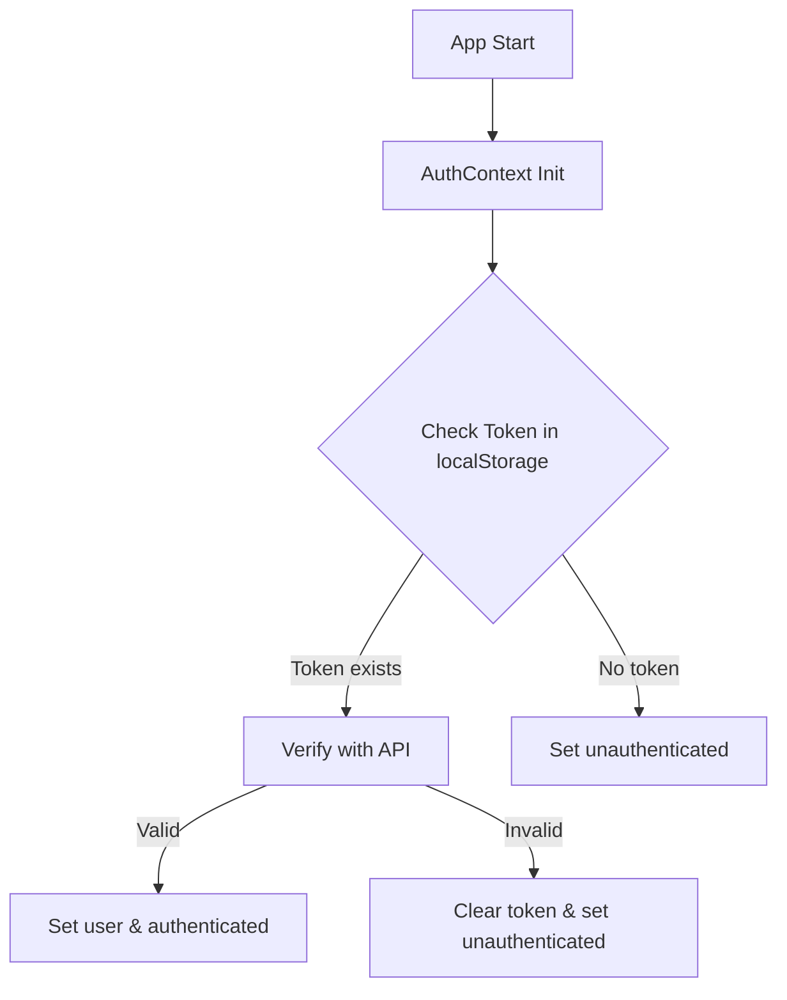
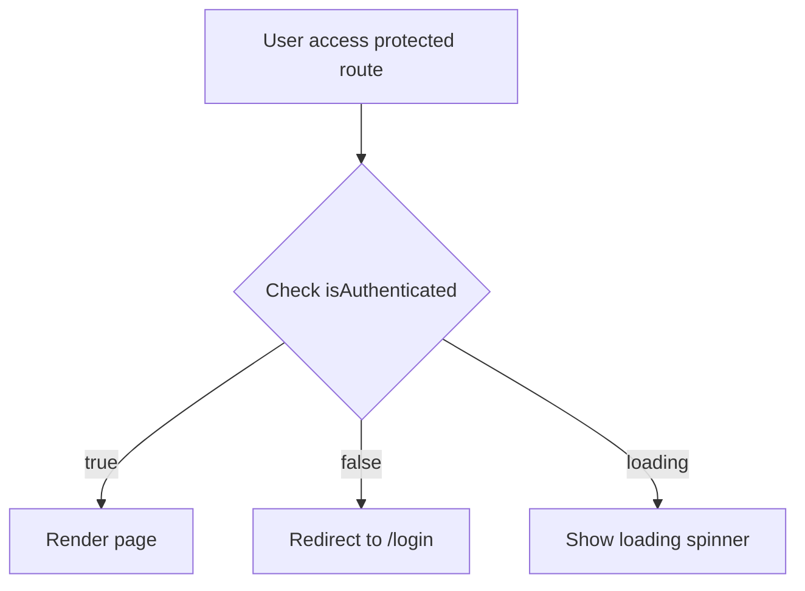

# 💰 Finance Management System

> Hệ thống quản lý tài chính cá nhân hiện đại được xây dựng với React, Tailwind CSS và shadcn/ui


### ✨ Tính năng nổi bật

- 🔐 **Xác thực đa dạng**: Đăng nhập thông thường và mạng xã hội
- 💼 **Quản lý ví đa tiền tệ**: Hỗ trợ VND, USD, EUR, JPY, GBP, KRW
- 🤝 **Chia sẻ ví**: Phân quyền chi tiết (xem, chỉnh sửa, toàn quyền)
- 📊 **Dashboard thông minh**: Biểu đồ và thống kê trực quan
- 🌙 **Dark/Light mode**: Giao diện tối/sáng
- 📱 **Responsive**: Tối ưu cho mọi thiết bị


## 🔑 Luồng đăng nhập Google (OAuth2)

### 1. Người dùng nhấn nút "Đăng nhập với Google"

- Tại trang đăng nhập (`src/modules/auth/pages/Login.jsx`), người dùng bấm nút:
  ```jsx
  <a href="http://localhost:8080/oauth2/authorize/google">
    <Button type="button" className="w-full">Đăng nhập với Google</Button>
  </a>
  ```
- Ứng dụng chuyển hướng sang Google để xác thực.

### 2. Google xác thực và chuyển hướng về ứng dụng

- Sau khi xác thực thành công, Google chuyển hướng về backend, backend xử lý và redirect về FE với `token` trên URL (ví dụ: `/oauth-callback?token=...`).

### 3. FE nhận token và hoàn tất đăng nhập

- Trang `src/modules/auth/pages/oauth-callback.jsx` sẽ lấy token từ URL:
  ```js
  const token = searchParams.get("token");
  loginGoogle(token);
  navigate("/dashboard");
  ```
- Hàm `loginGoogle` (trong `AuthContext.jsx`) sẽ:
  - Lưu token vào localStorage
  - Gọi API lấy thông tin user (`/user/profile`)
  - Cập nhật context đăng nhập

### 4. Backend xử lý

- Backend nhận mã xác thực từ Google, xác thực và tạo tài khoản nếu chưa có, trả về JWT token cho FE.

### 5. Tóm tắt luồng

1. FE → Google (qua backend) → xác thực
2. Google → Backend → trả token cho FE
3. FE nhận token, lưu và lấy profile
4. Đăng nhập thành công, chuyển hướng dashboard

> **Lưu ý:** Cần cấu hình biến môi trường `VITE_GOOGLE_CLIENT_ID` trong file `.env`.

---

## 🚀 Tính năng đã hoàn thành

### 🔐 Quản lý tài khoản

- ✅ **Đăng ký/Đăng nhập**: Username/password với validation
- ✅ **Đăng nhập mạng xã hội**: Google, Facebook, GitHub
- ✅ **Bảo mật**: Quên mật khẩu, kích hoạt email, đổi mật khẩu
- ✅ **Profile**: Cập nhật thông tin và ảnh đại diện
- ✅ **Quản lý tài khoản**: Xóa tài khoản và dữ liệu

### 💰 Quản lý ví tiền

- ✅ **Tạo ví**: Đa loại tiền tệ với icon và mô tả tùy chỉnh
- ✅ **Chi tiết ví**: Thống kê, biểu đồ, lịch sử giao dịch
- ✅ **Chuyển tiền**: Giữa các ví với tính phí
- ✅ **Nạp tiền**: Nhiều phương thức thanh toán
- ✅ **Chia sẻ ví**: Hệ thống phân quyền chi tiết
- ✅ **Lưu trữ ví**: Archive/restore ví không sử dụng

### 📊 Dashboard & Thống kê

- ✅ **Tổng quan tài chính**: Cards thống kê tổng hợp
- ✅ **Biểu đồ**: Line, Bar, Doughnut, Area charts
- ✅ **Phân tích**: Thu chi theo thời gian và danh mục
- ✅ **Giao dịch gần đây**: Lịch sử chi tiết

## 🛠️ Tech Stack

### Frontend Core

| Công nghệ      | Phiên bản | Mô tả                   |
| -------------- | --------- | ----------------------- |
| **React**      | 18.2.0    | Frontend framework      |
| **Vite**       | 4.0.3     | Build tool & dev server |
| **TypeScript** | Ready     | Type-safe development   |

### UI & Styling

| Công nghệ        | Phiên bản | Mô tả                |
| ---------------- | --------- | -------------------- |
| **Tailwind CSS** | 3.3.3     | Utility-first CSS    |
| **shadcn/ui**    | Latest    | Modern UI components |
| **Lucide React** | 0.263.1   | Beautiful icons      |

### State & Data

| Công nghệ           | Phiên bản | Mô tả                   |
| ------------------- | --------- | ----------------------- |
| **React Context**   | Built-in  | Global state management |
| **React Hook Form** | 7.45.4    | Form handling           |
| **Zod**             | 3.22.2    | Schema validation       |
| **Axios**           | 1.5.0     | HTTP client             |

### Charts & Visualization

| Công nghệ           | Phiên bản | Mô tả         |
| ------------------- | --------- | ------------- |
| **Chart.js**        | 4.5.0     | Chart library |
| **react-chartjs-2** | 5.3.0     | React wrapper |

### Development Tools

| Công nghệ        | Phiên bản | Mô tả               |
| ---------------- | --------- | ------------------- |
| **ESLint**       | 8.45.0    | Code linting        |
| **PostCSS**      | 8.4.29    | CSS processing      |
| **Autoprefixer** | 10.4.15   | CSS vendor prefixes |

## 📁 Cấu trúc dự án

```
src/
├── 📂 components/              # UI components tái sử dụng
│   ├── 📂 ui/                 # shadcn/ui components (Button, Card, Input...)
│   ├── 📂 charts/             # Chart components (Line, Bar, Doughnut...)
│   ├── 📄 DashboardLayout.jsx # Layout chính của ứng dụng
│   ├── 📄 Header.jsx          # Header với user menu
│   ├── 📄 Sidebar.jsx         # Navigation sidebar
│   └── 📄 ProtectedRoute.jsx  # Route protection HOC
│
├── 📂 modules/                # Chia theo tính năng (feature-based)
│   ├── 📂 auth/              # 🔐 Module xác thực
│   │   ├── 📂 contexts/      # AuthContext
│   │   ├── 📂 pages/         # Login, Register, ForgotPassword...
│   │   └── 📂 services/      # authService API calls
│   │
│   ├── 📂 dashboard/         # 📊 Module dashboard
│   │   ├── 📂 pages/         # Dashboard page
│   │   └── 📂 services/      # dashboardService
│   │
│   ├── 📂 wallets/           # 💰 Module quản lý ví (CORE)
│   │   ├── 📂 pages/         # WalletList, WalletDetail, AddWallet...
│   │   └── 📂 services/      # walletService
│   │
│   ├── 📂 profile/           # 👤 Module profile người dùng
│   ├── 📂 transactions/      # 💳 Module giao dịch (Future)
│   ├── 📂 reports/           # 📈 Module báo cáo (Future)
│   └── 📂 error/             # ❌ Error handling
│
├── 📂 shared/                # Utilities & services chung
│   ├── 📂 config/           # appConfig.js
│   ├── 📂 contexts/         # ThemeContext
│   ├── 📂 services/         # apiService (Axios config)
│   └── 📂 utils/            # Validation, error handling...
│
└── 📂 lib/                   # Helper functions
    └── 📄 utils.js          # cn() và utilities khác
```

### 🏗️ Kiến trúc Module

Mỗi module được tổ chức theo pattern:

```
module/
├── 📄 index.js              # Export chính
├── 📄 README.md             # Tài liệu module
├── 📂 components/           # Components riêng (nếu có)
├── 📂 pages/               # Các trang của module
├── 📂 services/            # API services
├── 📂 contexts/            # React contexts (nếu cần)
└── 📂 hooks/               # Custom hooks (nếu cần)
```

## 📋 Chi tiết Files và Luồng chạy

### 🚀 Entry Points (Điểm khởi đầu)

#### `src/main.jsx`

**Mục đích**: File khởi tạo ứng dụng React
**Nội dung**:

- Import React và ReactDOM
- Import CSS global (`index.css`)
- Render App component vào DOM
- Setup StrictMode cho development

**Cách hoạt động**:

```jsx
ReactDOM.createRoot(document.getElementById("root")).render(
  <React.StrictMode>
    <App />
  </React.StrictMode>
);
```

#### `src/App.jsx`

**Mục đích**: Component gốc của ứng dụng, setup routing và providers
**Nội dung**:

- **ThemeProvider**: Quản lý dark/light mode
- **AuthProvider**: Quản lý authentication state
- **Router**: Setup React Router cho navigation
- **Routes**: Định nghĩa tất cả routes (public + protected)
- **Toaster**: Setup thông báo toast global

**Luồng hoạt động**:

1. Wrap toàn bộ app với ThemeProvider và AuthProvider
2. Setup Router với các routes:
   - Public routes: `/login`, `/register`, `/oauth2/callback`
   - Protected routes: `/dashboard`, `/wallets/*`, `/profile`
3. Protected routes được bảo vệ bởi `<ProtectedRoute>`
4. Setup Toaster với duration 3s

---

### 🔐 Authentication Module (`src/modules/auth/`)

#### `contexts/AuthContext.jsx`

**Mục đích**: Quản lý global auth state
**Nội dung**:

- **State**: `user`, `loading`, `isAuthenticated`
- **Functions**: `login()`, `loginGoogle()`, `register()`, `logout()`, `updateProfile()`, `deleteAccount()`
- **Token Management**: Lưu/xóa JWT tokens
- **Auto-initialization**: Tự động check token khi app load

**Luồng hoạt động**:



#### `pages/Login.jsx`

**Mục đích**: Trang đăng nhập với form validation
**Nội dung**:

- **Form**: Username/email + password
- **Google OAuth**: Button redirect đến backend OAuth
- **State**: `formData`, `showPassword`, `notification`
- **Validation**: Client-side validation
- **UI**: Responsive form với dark mode support

**Luồng xử lý**:

1. User nhập thông tin → `handleChange()` update state
2. Submit form → `handleSubmit()` → `login()` từ AuthContext
3. Success → navigate to `/dashboard`
4. Error → hiển thị error message

#### `pages/Register.jsx`

**Mục đích**: Trang đăng ký tài khoản mới
**Nội dung**:

- **Form fields**: firstName, lastName, username, email, password, confirmPassword
- **Validation**: Required fields với dấu \* đỏ
- **Password toggle**: Show/hide password
- **Responsive**: Grid layout cho mobile/desktop

#### `pages/oauth-callback.jsx`

**Mục đích**: Xử lý callback từ Google OAuth
**Nội dung**:

- **useSearchParams**: Lấy token từ URL params
- **useRef**: Ngăn duplicate processing
- **Error handling**: Redirect về login nếu lỗi

**Luồng OAuth**:

```
User click Google → Backend OAuth → Google Auth →
Backend callback → Frontend callback (/oauth2/callback?token=xxx) →
Extract token → loginGoogle() → Navigate to dashboard
```

#### `services/authService.js`

**Mục đích**: Tất cả API calls liên quan đến authentication
**Nội dung**:

- `login()`: POST /auth/login
- `register()`: POST /auth/register
- `logout()`: POST /auth/logout
- `getCurrentUserProfile()`: GET /user/profile
- `updateProfile()`: PUT /user/profile
- `uploadAvatar()`: POST /user/avatar (multipart)

---

### 💰 Wallets Module (`src/modules/wallets/`)

#### `index.js`

**Mục đích**: Export tất cả pages và services của module
**Nội dung**:

```jsx
export { default as WalletList } from "./pages/WalletList";
export { default as WalletDetail } from "./pages/WalletDetail";
export { default as AddWallet } from "./pages/AddWallet";
// ... other exports
export { walletService } from "./services/walletService";
```

#### `pages/WalletList.jsx`

**Mục đích**: Hiển thị danh sách tất cả ví của user
**Nội dung**:

- **State**: `wallets`, `totalBalance`, `showArchived`
- **Features**: Filter active/archived, search, sort
- **Cards**: Mỗi ví hiển thị trong card với actions
- **Permissions**: Hiển thị badges theo quyền (owner, shared, viewer)

**Luồng hoạt động**:

1. `useEffect` → `fetchWallets()` → `walletService.getWallets()`
2. Tính tổng balance (convert USD → VND)
3. Filter theo `showArchived`
4. Render cards với actions tương ứng

#### `pages/WalletDetail.jsx`

**Mục đích**: Chi tiết 1 ví với thống kê và giao dịch
**Nội dung**:

- **Statistics Cards**: Balance, monthly income/expense, net change
- **Charts**: Balance over time, expense by category
- **Transactions**: Lịch sử giao dịch với pagination
- **Actions**: Edit, Share, Add money (nếu có quyền)

#### `pages/AddWallet.jsx`

**Mục đích**: Form tạo ví mới
**Nội dung**:

- **Form fields**: name, icon, currency, initialAmount, description
- **Icon picker**: Grid 32 icons để chọn
- **Currency support**: VND, USD, EUR, JPY, GBP, KRW
- **Preview**: Real-time preview của ví đang tạo
- **Validation**: Required fields và format validation

#### `pages/ShareWallet.jsx`

**Mục đích**: Chia sẻ ví với permissions
**Nội dung**:

- **Share types**: view, edit, full permissions
- **Multiple methods**: Email, SMS, link sharing
- **Permission management**: View/revoke shared wallets
- **QR Code**: Generate QR cho share link
- **Security notice**: Warnings về bảo mật

#### `services/walletService.js`

**Mục đích**: Tất cả API calls cho wallet operations
**Nội dung**:

- CRUD: `getWallets()`, `createWallet()`, `updateWallet()`, `deleteWallet()`
- Operations: `transferMoney()`, `addMoney()`, `getTransactions()`
- Sharing: `shareWallet()`, `getSharedWallets()`, `revokeShare()`
- Archive: `archiveWallet()`, `restoreWallet()`

---

### 📊 Dashboard Module (`src/modules/dashboard/`)

#### `pages/Dashboard.jsx`

**Mục đích**: Trang chủ với overview tài chính
**Nội dung**:

- **Stats Cards**: Total balance, income, expenses, savings
- **Charts**:
  - Line chart: Balance over time
  - Bar chart: Income vs Expenses
  - Doughnut: Spending by category
  - Area: Savings trends
- **Recent Transactions**: 5-10 giao dịch gần nhất
- **Quick Actions**: Shortcuts đến các tính năng chính

**Data Flow**:

1. `useEffect` → Multiple API calls parallel
2. `dashboardService.getStats()` → Overview numbers
3. `dashboardService.getChartData()` → Chart data
4. State updates → Re-render charts
5. Error handling → Fallback UI

#### `services/dashboardService.js`

**Mục đích**: API calls cho dashboard data
**Nội dung**:

- `getStats()`: GET /dashboard/stats
- `getRecentTransactions()`: GET /dashboard/recent-transactions
- `getSpendingByCategory()`: GET /dashboard/spending-by-category
- `getIncomeVsExpenses()`: GET /dashboard/income-vs-expenses

---

### 🎨 UI Components (`src/components/`)

#### `ui/` folder (shadcn/ui components)

**Mục đích**: Reusable UI primitives
**Nội dung**:

- `Button.jsx`: Button với variants (default, outline, ghost...)
- `Card.jsx`: Card container với Header, Content, Footer
- `Input.jsx`: Input field với styling
- `Label.jsx`: Form labels
- `Alert.jsx`: Alert/notification components

#### `DashboardLayout.jsx`

**Mục đích**: Layout wrapper cho protected pages
**Nội dung**:

- **Header**: User menu, theme toggle, notifications
- **Sidebar**: Navigation menu với active states
- **Main Content**: Outlet cho nested routes
- **Responsive**: Collapsible sidebar trên mobile

**Layout Structure**:

```jsx
<div className="dashboard-layout">
  <Header />
  <div className="flex">
    <Sidebar />
    <main className="flex-1">
      <Outlet /> {/* Nested routes render here */}
    </main>
  </div>
</div>
```

#### `ProtectedRoute.jsx`

**Mục đích**: HOC bảo vệ routes cần authentication
**Nội dung**:

- Check `isAuthenticated` từ AuthContext
- Nếu chưa auth → redirect to `/login`
- Nếu đã auth → render children
- Loading state trong khi check auth

**Luồng bảo vệ**:



---

### ⚙️ Shared Utilities (`src/shared/`)

#### `config/appConfig.js`

**Mục đích**: Central configuration cho toàn bộ app
**Nội dung**:

- **API config**: Base URL, timeout
- **Auth config**: Token keys, session timeout
- **App settings**: Name, version, theme defaults
- **Social auth**: Provider client IDs
- **Validation rules**: Password requirements

#### `services/apiService.js`

**Mục đích**: Axios instance với interceptors
**Nội dung**:

- **Base config**: Base URL, headers
- **Request interceptor**: Auto-attach JWT token
- **Response interceptor**: Handle token refresh, global errors
- **Error handling**: Network errors, 401/403 handling

**Request Flow**:

```
API Call → Request Interceptor (add JWT) →
Server → Response Interceptor →
Success: return data | Error: refresh token or logout
```

#### `utils/errorHandler.js`

**Mục đích**: Centralized error handling
**Nội dung**:

- `handleApiError()`: Process API errors → user-friendly messages
- `showSuccess()`: Success toast notifications
- `showError()`: Error toast notifications
- **Error mapping**: HTTP status → Vietnamese messages

#### `contexts/ThemeContext.jsx`

**Mục đích**: Dark/Light theme management
**Nội dung**:

- **State**: `theme` ('light' | 'dark' | 'system')
- **Functions**: `toggleTheme()`, `setTheme()`
- **Persistence**: Save to localStorage
- **System detection**: Auto-detect OS preference

---

### 🔄 Application Flow (Luồng chạy tổng thể)

#### 1. **App Initialization**

```
main.jsx → App.jsx → Providers setup → Router setup
```

#### 2. **Authentication Flow**

```
User lands → AuthContext checks token →
Valid: Set authenticated + user data |
Invalid: Clear auth state → Redirect if needed
```

#### 3. **Protected Route Access**

```
User navigates → ProtectedRoute checks auth →
Authenticated: Render page |
Not authenticated: Redirect to login
```

#### 4. **Login Flow**

```
Login page → User submits → AuthContext.login() →
API call → Success: Save token + redirect |
Error: Show error message
```

#### 5. **Google OAuth Flow**

```
Click Google button → Redirect to backend OAuth →
Google auth → Backend callback → Frontend oauth-callback →
Extract token → AuthContext.loginGoogle() → Dashboard
```

#### 6. **API Request Flow**

```
Component calls API → apiService interceptor adds JWT →
Request sent → Response interceptor →
Success: Return data |
401: Try refresh token |
Other errors: Show user message
```

#### 7. **Wallet Operations Flow**

```
WalletList → Fetch wallets → Display cards →
User clicks action → Navigate to detail/edit page →
Make changes → API call → Update state → Refresh UI
```

#### 8. **State Management Flow**

```
Component needs data → Check local state →
Not available: Call API → Update context/state →
Re-render components → UI reflects new data
```

#### 9. **Error Handling Flow**

```
Error occurs → errorHandler processes →
Determine error type → Show appropriate message →
Log for debugging → Graceful degradation
```

#### 10. **Theme Switching Flow**

```
User clicks theme toggle → ThemeContext.toggleTheme() →
Update state → Save to localStorage →
Apply CSS classes → UI updates immediately
```

---

## 🎨 Theme và Design

- **Color Scheme**: Màu xanh chủ đạo phù hợp với tài chính
- **Dark Mode**: Hỗ trợ chế độ sáng/tối
- **Responsive**: Tối ưu cho mobile và desktop
- **Typography**: Inter font family

## ⚙️ Cài đặt và Phát triển

### 📋 Yêu cầu hệ thống

- **Node.js** >= 16.0.0
- **npm** >= 8.0.0 hoặc **yarn** >= 1.22.0
- **Git** (để clone repository)

### 🚀 Hướng dẫn cài đặt

1. **Clone repository**

```bash
git clone https://github.com/Yenhi6886/finance-management-fe.git
cd finance-management-fe
```

2. **Cài đặt dependencies**

```bash
# Sử dụng npm
npm install

# Hoặc sử dụng yarn
yarn install
```

3. **Tạo file environment**

```bash
cp .env.example .env
```

4. **Cấu hình environment variables**

```env
# API Configuration
VITE_API_BASE_URL=http://localhost:8080/api

# Social Auth Configuration
VITE_GOOGLE_CLIENT_ID=your_google_client_id
VITE_FACEBOOK_APP_ID=your_facebook_app_id
VITE_GITHUB_CLIENT_ID=your_github_client_id

# App Configuration
VITE_APP_NAME="Finance Management System"
VITE_APP_VERSION="1.0.0"
```

5. **Chạy development server**

```bash
npm run dev
# Hoặc
yarn dev
```

6. **Mở ứng dụng**
   - Truy cập: `http://localhost:5173`
   - Hot reload được bật tự động

### 🏗️ Scripts có sẵn

```bash
# Development
npm run dev          # Chạy dev server với hot reload
npm run preview      # Preview production build locally

# Build & Production
npm run build        # Build for production
npm run build:dev    # Build for development/staging

# Code Quality
npm run lint         # Chạy ESLint
npm run lint:fix     # Tự động fix lỗi ESLint có thể sửa
npm run format       # Format code với Prettier

# Testing (Future)
npm run test         # Chạy unit tests
npm run test:watch   # Chạy tests trong watch mode
npm run test:coverage # Tạo coverage report
```

### 🔧 Development Tools Setup

**VS Code Extensions (Khuyến nghị):**

- ES7+ React/Redux/React-Native snippets
- Tailwind CSS IntelliSense
- ESLint
- Prettier - Code formatter
- Auto Rename Tag
- Bracket Pair Colorizer

**Chrome Extensions:**

- React Developer Tools
- Redux DevTools (nếu sử dụng Redux sau này)

## � API Integration

### 🔗 Backend Requirements

Dự án Frontend này cần kết nối với REST API Backend. Cấu trúc endpoint dự kiến:

### 🔐 Authentication Endpoints

```
POST   /auth/register           # Đăng ký tài khoản
POST   /auth/login              # Đăng nhập
POST   /auth/logout             # Đăng xuất
POST   /auth/refresh            # Refresh token
POST   /auth/forgot-password    # Quên mật khẩu
POST   /auth/reset-password     # Reset mật khẩu
POST   /auth/activate           # Kích hoạt tài khoản
GET    /auth/me                 # Thông tin user hiện tại
PUT    /auth/profile            # Cập nhật profile
DELETE /auth/account            # Xóa tài khoản
```

### 🤝 Social Authentication

```
POST   /auth/google             # Đăng nhập Google
POST   /auth/facebook           # Đăng nhập Facebook
POST   /auth/github             # Đăng nhập GitHub
```

### 💰 Wallet Management

```
GET    /wallets                 # Danh sách ví
POST   /wallets                 # Tạo ví mới
GET    /wallets/:id             # Chi tiết ví
PUT    /wallets/:id             # Cập nhật ví
DELETE /wallets/:id             # Xóa ví
POST   /wallets/:id/archive     # Lưu trữ ví
POST   /wallets/:id/restore     # Khôi phục ví

# Wallet Operations
POST   /wallets/:id/deposit     # Nạp tiền
POST   /wallets/:id/transfer    # Chuyển tiền
GET    /wallets/:id/transactions # Lịch sử giao dịch

# Wallet Sharing
POST   /wallets/:id/share       # Chia sẻ ví
GET    /wallets/:id/shares      # Danh sách chia sẻ
DELETE /wallets/:id/shares/:shareId # Hủy chia sẻ
```

### 📊 Dashboard & Analytics

```
GET    /dashboard/stats         # Thống kê tổng quan
GET    /dashboard/recent-transactions # Giao dịch gần đây
GET    /dashboard/spending-by-category # Chi tiêu theo danh mục
GET    /dashboard/income-vs-expenses # Thu chi theo thời gian
GET    /dashboard/savings-over-time # Tiết kiệm theo thời gian
```

### 🔧 Response Format

Tất cả API responses tuân theo format:

```json
{
  "success": true,
  "message": "Success message",
  "data": {
    // Response data here
  },
  "meta": {
    "pagination": {
      "page": 1,
      "limit": 10,
      "total": 100
    }
  }
}
```

### 🛡️ Authentication Flow

1. **Login**: POST `/auth/login` → Nhận `access_token` và `refresh_token`
2. **Request**: Gửi `Authorization: Bearer {access_token}` trong header
3. **Refresh**: Khi token hết hạn, dùng `refresh_token` để lấy token mới
4. **Logout**: POST `/auth/logout` để invalidate tokens

## 🎨 UI/UX Design

### 🎭 Theme System

- **Light Mode**: Giao diện sáng với màu chủ đạo xanh lá
- **Dark Mode**: Giao diện tối thân thiện với mắt
- **Auto Switch**: Tự động theo hệ thống hoặc tùy chọn người dùng

### 🎨 Color Palette

```css
/* Primary Colors */
--primary: #22c55e; /* Green 500 */
--primary-foreground: #ffffff;

/* Background Colors */
--background: #ffffff; /* Light mode */
--background-dark: #0f172a; /* Dark mode */

/* Card & Components */
--card: #ffffff;
--card-dark: #1e293b;
--border: #e2e8f0;
--border-dark: #334155;
```

### 📐 Component Design Principles

- **Consistency**: Sử dụng design system thống nhất
- **Accessibility**: Tuân thủ WCAG 2.1 guidelines
- **Minimalism**: Giao diện sạch sẽ, tập trung vào nội dung
- **Mobile-First**: Thiết kế ưu tiên mobile trước

### 📱 Responsive Breakpoints

```css
sm: 640px    /* Mobile landscape */
md: 768px    /* Tablet */
lg: 1024px   /* Desktop */
xl: 1280px   /* Large desktop */
2xl: 1536px  /* Extra large */
```

## 🔒 Security Features

### 🛡️ Frontend Security

- **JWT Token Management**: Secure storage và auto-refresh
- **Route Protection**: ProtectedRoute HOC cho các trang cần xác thực
- **Input Validation**: Client-side validation với Zod schema
- **XSS Prevention**: Sanitization của user inputs
- **CSRF Ready**: Cấu hình sẵn CSRF token support

### � Authentication Security

- **Password Requirements**: 6-8 ký tự (có thể tùy chỉnh)
- **Token Expiration**: Automatic token refresh
- **Secure Storage**: LocalStorage với encryption sẵn sàng
- **Session Management**: Logout khi detect suspicious activity

### 🚫 Error Handling

- **Global Error Boundary**: Catch và handle React errors
- **API Error Handling**: Centralized error processing
- **User-Friendly Messages**: Hiển thị lỗi dễ hiểu cho người dùng
- **Logging**: Error logging cho debugging (development)

## 🚀 Roadmap & Development Plan

### ✅ Phase 1: Core Foundation (Completed)

- [x] **Authentication System**: Login, Register, Social Auth
- [x] **User Management**: Profile, Password, Account deletion
- [x] **Wallet Management**: CRUD operations, multi-currency
- [x] **Wallet Sharing**: Permission-based sharing system
- [x] **Dashboard**: Basic stats and visualizations
- [x] **UI/UX**: Responsive design with dark/light theme

### 🚧 Phase 2: Transaction Management (In Progress)

- [ ] **Transaction CRUD**: Tạo, sửa, xóa giao dịch
- [ ] **Category Management**: Phân loại thu chi
- [ ] **Transaction Import**: Import từ CSV/Excel
- [ ] **Recurring Transactions**: Giao dịch định kỳ
- [ ] **Transaction Search**: Tìm kiếm và filter nâng cao

### 📊 Phase 3: Advanced Analytics (Planned)

- [ ] **Financial Reports**: Báo cáo thu chi chi tiết
- [ ] **Spending Analysis**: Phân tích chi tiêu theo patterns
- [ ] **Budget Planning**: Lập và theo dõi ngân sách
- [ ] **Goal Setting**: Mục tiêu tiết kiệm và đầu tư
- [ ] **Export Features**: PDF, Excel export

### 🔮 Phase 4: Smart Features (Future)

- [ ] **AI Insights**: Gợi ý thông minh về chi tiêu
- [ ] **Bill Reminders**: Nhắc nhở hóa đơn
- [ ] **Investment Tracking**: Theo dõi đầu tư
- [ ] **Multi-bank Integration**: Kết nối ngân hàng
- [ ] **Mobile App**: React Native version

### 🛠️ Technical Improvements (Ongoing)

- [ ] **Testing**: Unit, Integration, E2E tests
- [ ] **Performance**: Code splitting, lazy loading
- [ ] **PWA**: Progressive Web App features
- [ ] **Offline Support**: Offline functionality
- [ ] **CI/CD**: Automated deployment pipeline

## 🧪 Testing Strategy

### 🔬 Testing Levels

- **Unit Tests**: Components và utilities (Jest + React Testing Library)
- **Integration Tests**: API integration và user flows
- **E2E Tests**: End-to-end scenarios (Playwright/Cypress)
- **Visual Tests**: Screenshot testing cho UI consistency

### 📊 Coverage Goals

- **Unit Tests**: > 80% coverage
- **Critical Paths**: 100% coverage cho authentication và transactions
- **Components**: Tất cả reusable components được test

## 📈 Performance Optimization

### ⚡ Current Optimizations

- **Vite Build**: Fast bundling và HMR
- **Code Splitting**: Dynamic imports cho routes
- **Image Optimization**: Lazy loading và WebP support ready
- **Bundle Analysis**: Webpack bundle analyzer integration

### 🎯 Performance Targets

- **First Contentful Paint**: < 1.5s
- **Largest Contentful Paint**: < 2.5s
- **Cumulative Layout Shift**: < 0.1
- **Time to Interactive**: < 3.5s

## 🤝 Contributing Guidelines

### 🔄 Development Workflow

1. **Fork** repository về tài khoản cá nhân
2. **Clone** fork về local machine
3. **Create branch** từ `dev`: `git checkout -b feature/amazing-feature`
4. **Develop** feature với commit messages rõ ràng
5. **Test** thoroughly trước khi push
6. **Push** branch: `git push origin feature/amazing-feature`
7. **Create Pull Request** vào branch `dev`

### 📝 Commit Convention

```
type(scope): description

feat(auth): add social login with Google
fix(wallet): resolve transfer money calculation
docs(readme): update installation guide
style(ui): improve button hover effects
refactor(api): optimize API call structure
test(wallet): add unit tests for wallet service
```

### 🎯 Code Standards

- **ESLint**: Tuân thủ rules được config
- **Prettier**: Format code consistency
- **TypeScript**: Sử dụng types cho các API calls
- **Comments**: JSDoc cho functions và components quan trọng

## 📄 License

Distributed under the **MIT License**. See [`LICENSE`](LICENSE) for more information.

```
MIT License

Copyright (c) 2025 Finance Management System

Permission is hereby granted, free of charge, to any person obtaining a copy
of this software and associated documentation files (the "Software"), to deal
in the Software without restriction, including without limitation the rights
to use, copy, modify, merge, publish, distribute, sublicense, and/or sell
copies of the Software, and to permit persons to whom the Software is
furnished to do so, subject to the following conditions:

The above copyright notice and this permission notice shall be included in all
copies or substantial portions of the Software.
```

## 📞 Contact & Support

### 👥 Development Team

- **Project Lead**: [Yenhi6886](https://github.com/Yenhi6886)
- **Frontend Developer**: Finance Management Team
- **UI/UX Designer**: Design Team

### 📧 Contact Information

- **Email**: [support@financemanagement.com](mailto:support@financemanagement.com)
- **Issues**: [GitHub Issues](https://github.com/Yenhi6886/finance-management-fe/issues)
- **Discussions**: [GitHub Discussions](https://github.com/Yenhi6886/finance-management-fe/discussions)

### 🔗 Useful Links

- **Repository**: [https://github.com/Yenhi6886/finance-management-fe](https://github.com/Yenhi6886/finance-management-fe)
- **Documentation**: [Wiki](https://github.com/Yenhi6886/finance-management-fe/wiki)
- **Bug Reports**: [Issue Tracker](https://github.com/Yenhi6886/finance-management-fe/issues/new?template=bug_report.md)
- **Feature Requests**: [Feature Request](https://github.com/Yenhi6886/finance-management-fe/issues/new?template=feature_request.md)

### 🆘 Getting Help

1. **Check Documentation**: Xem wiki và README trước
2. **Search Issues**: Tìm kiếm issues đã có
3. **Ask Questions**: Tạo discussion mới
4. **Report Bugs**: Sử dụng bug report template

---

<div align="center">

### 🌟 Nếu project này hữu ích, hãy cho chúng tôi một ⭐ trên GitHub!

**Made with ❤️ by Finance Management Team**

[⬆️ Back to top](#-finance-management-system)

</div>
